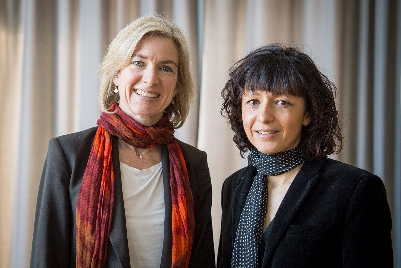
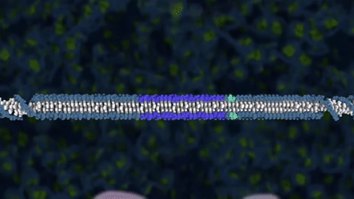

Since the discovery of the double helix in 1953 we've developed an understanding of DNA as the 'code of life'. In this post I'll examine the similarities and differences between biological code and computer code.

## The Code Breaker

I recently finished Walter Isaacson's biography of Jennifer Doudna, aptly titled 'The Code Breaker'. The book recounts Doudna's work on RNA, culminating with her and Emmanuelle Charpentier's discovery of CRISPR, for which the pair recieved the Nobel Prize in Chemistry in 2020, 8 years after their groundbreaking research was published.

<figure>

<figcaption>Jennifer Doudna and Emmanuelle Charpentier share the 2020 Nobel chemistry prize for their discovery of a game-changing gene-editing technique.
Source: <a href="https://www.nature.com/articles/d41586-020-02765-9">Nature</a> 
</figcaption>
</figure>

### CRISPR

CRISPR, which stands for Clustered, Regularly Interspaced Short Palindromic Repeats

<figure>

<figcaption>A segment of the video "New CRISPR-powered device detects genetic mutations in minutes"
Source: <a href="https://commons.wikimedia.org/wiki/File:CRISPR_illustration_gif_animation_1.gif">Wikipedia</a> 
</figcaption>
</figure>

Computer code ultimately compiles down to 0s and 1s. Similarly, genetic code compiles down to As, Cs, Gs, and Ts. The 0s and 1s are unintelligible to humans, even though humans are the ones who write computer code everyday. That's because humans don't manually program the 0s and 1s, they write code in programming languages that serve as an abstraction between the machine code and the human author.
